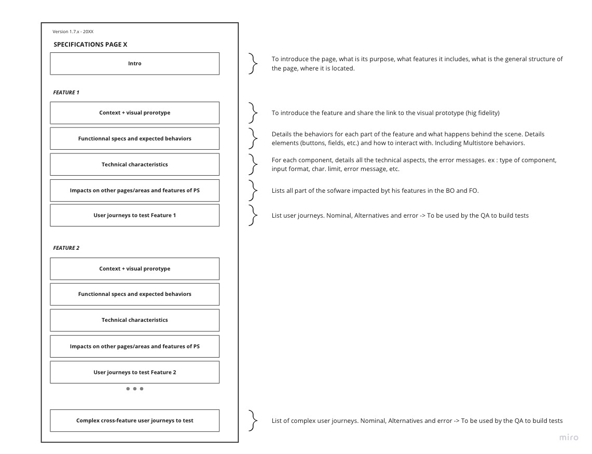

# Specs template v1.0
December 19

### Disclaimer:
This document is a template which purpose is to present the structure and tone of voice/semantic specifications should follow.

The information detailed in this file are not relevant, and the different parts are not related to each other. It is made from different specs stitched together.

Do not attempt to build what is written below

### Structure

This template follows the structure as in the following image.
Each part will be announced, written in capital letters between ~ on the full width of the page.
For Instance before the Intro there will be a ~INTRO~.

---
---
---

**Specifications for the order view page for 1.7.7 - 2019**

# ~~~~~~~~~~~~~~~~~~~~~~~~~ INTRO ~~~~~~~~~~~~~~~~~~~~~~~~~

# **User Story:**

# As a merchant, I need to be able to manage all my orders online and manual one.

As merchant managing order is essential for my e-commerce, I need to be able to:

-   Check the order’s product to prepare it
-   Manage the order’s progress,
-   Edit the customer information or send him messages,
-   To print his invoice,
-   Handle payment methods,
-   to follow my shipping through activities,
-   Returns and refunds

**WHY**

The Add order page _(Orders > Orders > View button)_ is expected to be migrated to Symfony for the 1.7.7 version and will be reworked for better user experience.

Some new specifications for the new design are in progress but to avoid any features regressions. We need to specify the whole behaviour of this page to make it easier to compare the new scenario and avoid any new bugs and regressions.

**Related issue**:

[https://docs.google.com/spreadsheets/d/1wfwQRJ28cXQmhGDZcW05RpD12HZ2Em3_bVvR1r9_m_k/edit?usp=sharing](https://docs.google.com/spreadsheets/d/1wfwQRJ28cXQmhGDZcW05RpD12HZ2Em3_bVvR1r9_m_k/edit?usp=sharing)

**WHAT**

Thus, this project aims at specifying the new behaviours for every scenario a merchant could be dealing with the order management. This specification should specifically define :

-   Order (order status, invoices, cancellation)
-   Customer (customer card and addresses)
-   Paiement
-   Messages
-   Refund
-   Product & voucher

**SPECIFICATIONS**

**Orders > Orders > View order**

The user access to the order view page by either clicking on **the order’s row** or **the view button**.

**Generic page operation - Order view**

On the header, we have **the order’s reference, customer’s name, total price in black background, the date and the hour**.

# ~~~~~~~~~~~~~~~~~~~~~~~~~ FEATURE ~~~~~~~~~~~~~~~~~~~~~~~~~
## I. **Action panel**

**Bellow the panel’s header**, we have all the order's action button:

-   **Update the order status**
-   **Print order button**
-   **View invoice show button**
-   **View delivery slip button**
-   **Partial refund button**
-   **Standard Refund* button*
-   **Return products button**
-   **Cancel products button**
-   **Cancel button**

1.  **Update the order status**

The current status is displayed by default on the droplist. It can be changed by selecting the new order's status from the droplist after validating the confirmation button.

2.  **Print order button**

Opens the Print page of the browser with the order’s content.

[pdf file result 1/2](https://invis.io/YKTGGFZAMCB#/386350135_Order_Details_-_Print_Order_1)

[pdf file result 2/2](https://invis.io/YKTGGFZAMCB#/386350136_Order_Details_-_Print_Order_2)

3.  **View invoice show**

If the current or new order status as **the generation of the invoice activated,**  **the button is shown or** the user generates it manually.

When the user clicks on the button, it downloads the invoice.

4.  **View delivery slip**

If the current or new order status as **the generation of the delivery slip** then **the button to download the delivery slip is shown.**

5.  **Partial refund button**

If the current or new order status of order considered **as paid** then **the button is shown.** After clicking on the button, then the product table will take the full width of the page. The user can edit the refund amount by product and also the shipping cost. He must select the quantity of the product concerned for the refunded and then write refund amount chosen by product rows. The maximum refundable amount is written bellow all the amount input in tax included.

By default, the quantity input has 0 prefilled. To validate a partial refund, the user must must as selected minimun 1 quantity.

**Before the validating a partial refund,** the user can choose to re-stock or generate a voucher by checking the checkboxes.

When the status "Refunded" is applied to the order, the refund amount is deducted to the total spended by the customer since registration and the number of valid orders placed decreases by 1.

[Partial Refund screen](https://invis.io/YKTGGFZAMCB#/385922519__Order_Details_-_Partial_Refund)

**After the validation a partial refund,** a new column is added with quantity previously selected and the amount entered.

6. **Cancel products button**

The cancel button only is shown by default on the creation of an order.
The button **disappears** when the order is **considered as paid**

When pressing the button, the product list takes the full with of the page and the column cancel is added.
On the column cancel, a checkbox and quantity input is displayed. Checking the checkbox will prefill the quantity input with the quantity of the product ordered.
The quantity input can still be editable.

Pressing the button cancel will reduce the quantity of the products selected if there still some left otherwise it deletes the product from the list.

To cancel products at least one of the product must be selected.

**When all the products are cancelled, the status automatically changes for "Canceled".**

7. **Standard products button**

Standard refund only **appears when the merchandise returns are activated and the order is considered as paid** and **disappears when the order is considered as shipped.**

When the user presses the button a column "Refund" is added with a checkbox and the input quantity.

A quantity must be selected to refund a product.

Before refunding the products, the user can choose to generate a credit slip and/or voucher.
**See if you can add the button restock**

When all the products are refunded order status change to Refunded.
A product can't be refund multiple times.

After refunding, it shows on a column "Refunded", the quantity and the price of the refund per products.

8.  **Return products button**

Return product only **appears when the merchandise returns are activated and the order is considered as paid** and **disappears when the order is considered as shipped.**

When the user presses the button a column "Refund" is added with a checkbox and the input quantity.

A quantity must be selected to refund a product.
A product can be return if it has been re-stock before by another process has standard, cancel or partial refund button.
A product can't be refund multiple times.

Before refunding the products, the user can choose to generate a credit slip and/or voucher or/and re-stock.

After returning the products, it shows on a column "Return" and "Refund" with the return quantity and the price of the refund per products if a generated slip was checked in the option.

# ~~~~~~~~~~~~~~~~~~~~~~~~~ FEATURE ~~~~~~~~~~~~~~~~~~~~~~~~~
## II. **Customer panel**

The customer panel displayed on the left of the product list has **the customer’s title, name, last name and customer reference.** To see the full customer description, you can click on **View full details** that redirect to his customer page on another page.

Customer panel is divided into 3 parts:

-   Customer card regrouping the customer’s information
-   Shipping and Invoice address
-   Private customer note

**Customer card** displays :

-   **the email on a “mailto” link**
-   **date of the account registered**
-   **valid orders placed on a black background**
-   **total spend since registration on a black background.**

**Shipping and Invoice address**

Each address has **a button** to update or change it. The button opens a list to select the user wants to edit or update it.

[Edit/Change adresse behaviours](https://invis.io/YKTGGFZAMCB#/386397109_Edit_Adress)

**The edit address redirects to the edit address page of the selected address**. After saving any edit of the fields of the address form, **the user is redirected on the order** that he was editing in the first place.

And **change address** opens the popin that allows the user to choose the new address form a droplist.

[Popin - Change address](https://invis.io/YKTGGFZAMCB#/382686482__Order_Details_-_Change_Adress)

**Private customer note** is closed by default when it is empty and open bu default when filled. To add a note when it is empty, the user has to click on the + button and has to press on the save button to save it.

[Customer private note](https://invis.io/YKTGGFZAMCB#/386397644_Private_Note_Behavior)

# ~~~~~~~~~~~~~~~~~~~~~~~~~ FEATURE ~~~~~~~~~~~~~~~~~~~~~~~~~
## III. **Messages panel**

Bellow the customer panel, you have the messages panel. **The total of the exchanged messages** is displayed next to the panel's title.

**Only the 4 last messages** private or public are displayed showing **the sender’s name, delivery’s date and the content’s message. The private message** is displayed with a dark background and a specific icon for the sender pic.

[Messages Panel](https://invis.io/YKTGGFZAMCB#/378991321__Order_Details)

Bellow the messages displayed, the user can **choose a standard message** to send. **all predefined messages** of the **order messages page** are available in a droplist to select the message to prefill **the message input text**. By default, there is no prefilled message so the droplist shows “-”. The link named **"configure predefined messages ->"** below the droplist is available to open on a new browser's tab **the order messages page** to access to the predefined messages.

After selecting the droplist selection, the prefilled text is still editable.

**A checkbox** is available to choose **to write a private message hidden from the customer.**

Customizing the prefilled message, writing the message from scratch or using the prefilled message, the user sends it by clicking on **Send message**. It sends the email and adds the message on the front-office on the message section of **the order historic page and an email** as presented on the screenshots below.

**To see all the past messages**, there is the possibility to click on the right of the send message button on **View full conversation** to open on a popup.

[Message History](https://invis.io/YKTGGFZAMCB#/386399527__Order_Details_-_Message_History)

# ~~~~~~~~~~~~~~~~~~~~~~~~~ FEATURE ~~~~~~~~~~~~~~~~~~~~~~~~~
## IV. **Product panel**

Bellow the action button on the right, the product panel displays **the order’s products into the table list** showing:

-   **the product’s image,**
-   **product name (composed of the name, combination name and reference),**
-   **stock location,** if one of the product has one
-   **base price with tax included,**
-   **quantity,**
-   **available quantity,**
-   **total with tax included,**
-   **and 2 action button edit and delete.**

**When the product has customization**, a row is added bellow the product with the labels of the customization and the content from the customer (image or text). When the number of images exceeds the size of the toe, they go to the next line.

[popin displaying the products from the pack](/img/customization.png)

**When the product is pack of product**, a link is added bellow the product name to show all the product in an popin.

[Link in the product row](/img/view20%pack20%content.png)

By pressing on the link "View pack content", it opens the products from the pack in a popin:

[Popin displaying the products from the pack](/img/pack20%content.png)

**The pagination of the list starts when there are more than 8 products**
**The stock location column is hidden** only when none of the products has a stock location only on the website. The column is only displayed at the corresponding pagination. If only a product on page 2 of the list has a stock location then the stock location column appears on page 2 and hidden in the other pages.

[Pagination design](https://projects.invisionapp.com/share/YKTGGFZAMCB#/screens/392128609)

**The quantity** is coloured in a dark grey background if there are more than 2 quantities.

**The edit button** allows the user to edit the excluded and included base price and quantity. If the user edit an amount in the input without taxe it will insert the amount plus the product taxes in the input with taxe automatically. And vice versa, if the user edit an amount in the input with taxe it will insert the amount less the product taxes in the input without taxe.

The merchant is warn if he edits the price of product with a specific price or an catalog price rule.

**While editing the quantity, the total updates itself** to let know to the user impact price that it will have.
The **Update button** to save the modification or **Cancel button** to drop it.

**The Delete button removes the product for the list.**

**A confirmation pop-up appears after clicking on the Update button or the Delete button.**

At the end of the table list, there are **2 buttons**:

-   **Add a product:** add a row on the table list with a search bar on the product name column. If the desired product has combinations, a drop list can appear below the search bar. After selecting the product, the user can edit if needed the base price tax excluded or tax included and the quantity. The quantity input is an input type number that decreases the available quantity when the user increases the quantity. If the quantity selected is higher than the stocks, available quantity label becomes red. The product is added in the product table and to the order after **pressing on the add button** if the there is enough quantity otherwise a warning error is shown (except if the stock parameter allows to sell without stocks).

[Add a product old design but the same behaviours](https://github.com/PrestaShop/prestashop-specs/blob/master)

-   **Add a new discount**: opens a popin to create your new voucher between the Pourcentage, the Amount (taxes included) and Free shipping type.

[Popin add discount](https://invis.io/YKTGGFZAMCB#/381874231__Order_Details_-_Add_Discount)

The vouchers will be added on the table list displaying the discount name, value and the delete button on the top of the summary order. The new discount created is added with the status deactivated on cart rule page with zero quantity.

[Carts rules list](https://invis.io/YKTGGFZAMCB#/385922052__Order_Details_-_Discounts_Applied)

**If the order status is considered as paid**, either on adding a product or adding a discount adding, the user as to specify on **which generated invoices it will be applied.**

The bottom of the product panel resume in a list all the order:

-   **Products total with taxes excluded**
-   **Total shipping**
-   **Discount** if there is any cart rule applied
-   **Wrapping** if there is wrapping option in the order
-   **Taxes**
-   **Total** in black background

Below the totals, a warning message is displayed to warn the user that **for this customer group, prices are displayed as HT** or **for this customer group, prices are displayed as TTC** depending on the customer group setting and also **that returns are disabled.** when the merchandise return is disabled on the merchandise returns page.

# ~~~~~~~~~~~~~~~~~~~~~~~~~ FEATURE ~~~~~~~~~~~~~~~~~~~~~~~~~
## V. Tabs panel

All the tabs are located in the same panel bellow the products list.

The label "Wrapping gift" and "Recycled packaging" are only shown when the feature are present in the order. It must be shown on all the tabs.

1.  **Status tab**

The table **list of the latest order status** is displayed composed:

-   **The status with associated coloured**
-   **date and hour**
-   **The editor**
-   **Button to resend the email to the customer**

On the bottom, a drop list of all the status available is shown to update the current status through the **button Update Status** next to it. Updating the order status will trigger all the actions set by the order status.

2.  **Documents tab**

The document tab **regrouped all the document** as invoices and delivery slips **in a table**. The table displays **the date, document type, reference and the amount.** The reference is a clickable link to download the document.

Each table’s rows as 2 possible **button actions**:

-   **Enter payment**: it redirects to the payment panel to fill the transaction with the invoice preselected.
-   **Add note/Edit note**: it displays a text input that can be saved or cancel. The saved note will be integrated into the related document.

**If there is no document**, **a button is available to generate an invoice** with all the information saved so far in the order.

3.  **Shipping tab**

The carrier table shows **the date, the carrier, the weight, the shipping cost, the tracking number and edit button.**

[Shipping tab](https://invis.io/YKTGGFZAMCB#/381874233__Order_Details_-_Shipping)

The edit shipping button on each row can edit the information in a popin. You can edit the text input the tracking number and in the drop list the carrier method.

[Edit shipping details](https://invis.io/YKTGGFZAMCB#/381874230__Order_Details_-_Shipping_-_Edit)

4.  **Merchandising returns tab**

The merchandise return tab lists **the date, the tracking number, the type, Carrier (which is the return status) and the quantity**. When the merchandise return is disabled the tab displayed: "no merchandise returned yet".

5.  **Payment panel**

The payment section displays all the transactions made in the order from the payment’s module or the manual inputs.

The table shows **the date and hours, the payment method, the transaction ID, the amount with the currency and the button detail.**

To fill a payment transaction, the user has **to select the date, one payment method from a droplist, the amount and currency then press the add button. The amount** can be a **positive or negative value**.

**A red warning is shown** if the filled amount is inferior or superior of the order’s total comparing the total of the transactions and order’s total.

After adding, the user can display **all the details of the transaction by pressing the Detail button**. It will show below the arrow **the number, brand, expiration date and owner of the credit card** for any payment module.

**If the order’s status** is considered **as paid then before adding a transaction** the user has to specify in **which generated invoices from a droplist** it will be added.

When the status accepted (waiting for payment) you can change the currency of the order with a drop list.

---

# ~~~~~~~~~~~~~~~ TECH CHARACTERISTICS ~~~~~~~~~~~~~~~

# SPECS PRODUCT PAGE

As a merchant I need to be able to correctly create, edit and delete my products.

## WHY

The add / edit product page \(Catalog &gt; Products\) has already been migrated to Symfony for the 1.7.0 version, but many behaviours are not specified which have introduced regressions and bugs. We need to specify the whole behaviour of this page to make it easier to test and avoid any new bugs.

Furthermore, we have identified different issues related to this page that we should fix during the re-migration : [https://github.com/PrestaShop/PrestaShop/issues/13891](https://github.com/PrestaShop/PrestaShop/issues/13891)

## WHAT

Thus, this project aims at specifying the current and expected behaviour for every scenario a merchant could be dealing with when creating / editing a product for his/her customers.

## SPECIFICATIONS

[The first step is to detail the behavior of each field per tab when creating / editing a product.](https://github.com/PrestaShop/prestashop-specs/blob/master/back-office/catalog/catalog-products-add-edit.md#product-creation-edition)

[The second step of this document is to detail the type of each fields and error messages per tab.](https://github.com/PrestaShop/prestashop-specs/blob/master/back-office/catalog/catalog-products-add-edit.md#errors)

The third step is to detail the multistore behavior.

## 1.    Product creation / edition on Back office 

### Elements in all tabs \[[EPIC](https://github.com/PrestaShop/PrestaShop/issues/14770)\]

**As a merchant I want to always see some elements when I create or edit a product.**

Some elements are displayed in all tabs. Here is the list of those elements :

* **Product name**: When you create a new product, this field is empty and there is a placeholder: “Enter your product name”.
Only the name in the default language must be filled, if the product name is not filled for all languages, then it must retrieve the product name in the default language.
A drop-down next to the field is displayed when there are several languages installed \(disabled languages are diplayed in the drop-down\). It allows to choose in which language the field is displayed.
If the content does not exist in a language, it must retrieve the content of the default language. Also, in the case of multilanguage, if an error occurs, then I must be warned in the message which language is problematic.
* **Product type**: Drop-down with 3 : Standard product, Pack of products, Virtual product.
Please note, when editing a standard product with combinations, you can’t change the type, the drop-down is disabled.
* **Sales**: This link redirect to Stats &gt; product detail and is open in a new browser tab
* **Product list**: Link that displays the list of all products filtered as in the catalog, with their id, name, price, quantity.
If you click on the id or the name, you arrive on the product page in basic settings tab.
If you click on the price, you arrive on the product page in pricing tab.
If you click on the quantity, you arrive on the product page in the second tab which is: Quantities for a standard product without combinations or a pack, Combinations for a standard product with combination, Virtual product for a virtual product.
* **Help**: Link to display the help in the right menu.
* **Delete**: Button to delete the product. When you click on it, you have a modal to cancel or confirm the action.
* **Preview**: When you click on this button, it saves and open a new browser tab with the product displayed in front-office.
If the product is disabled \(offline\), you have on the product page in front-office a message displayed: “This product is not visible to your customers.”
Keyboard shortcut: ALT + SHIFT + V
* **Online**: When you click on this button, it saves and makes the product visible in front-office.
* **Offline**: When you click on this button, it saves and makes the product invisible in front-office.
* **Save**: Button to save all changes made in all tabs.
Keyboard shortcut: ALT + SHIFT + S.
If it’s saved with success, there is a green success message “Settings updated”. Otherwise, there is an error message.
* **Duplicate**: When you click on this button, it saves and duplicate the current product \(the duplicated product will be offline\). The duplicated product must be exactly the same.
Keyboard shortcut: ALT + SHIFT + D
* **Go to catalog**: When you click on this button, it saves and redirect to catalog product list.
Keyboard shortcut: ALT + SHIFT + Q
* **Add new product**: When you click on this button, it saves and opens a new empty product page.
Keyboard shortcut: ALT + SHIFT + P

### Basic settings tab \[[EPIC](https://github.com/PrestaShop/PrestaShop/issues/14763)\]

**As a merchant I want to be able to complete the basic information of my products.**

Here is the list of the elements of basic settings tab:

* **Combinations**: If you have selected standard product in the drop-down, you have 2 radios buttons: simple product or product with combinations.
If product with combination is selected, under the two radio buttons, there is a “combinations” link. When you click on it, you switch to combinations tab.
If product with combinations was selected & combinations were generated, when I change for simple product, a modal is displayed alerting all combinations will be deleted and ask to confirm or cancel the action.
* **Reference**: The reference is displayed in the product details part in front-office.
* **Summary**: The text can be formatted thanks to the TinyMCE editor \([improvement 14985](https://github.com/PrestaShop/PrestaShop/issues/14985)\)
A drop-down next to the field is displayed when there are several languages installed \(disabled languages are diplayed in the drop-down\). It allows to choose in which language the field is displayed. Also, in the case of multilanguage, if an error occurs, then I must be warned in the message which language is problematic \([improvement 16299](https://github.com/PrestaShop/PrestaShop/issues/16299)\)
* **Description**: The text can be formatted thanks to the TinyMCE editor \([improvement 14985](https://github.com/PrestaShop/PrestaShop/issues/14985)\)
A drop-down next to the field is displayed when there are several languages installed \(disabled languages are diplayed in the drop-down\). It allows to choose in which language the field is displayed. Also, in the case of multilanguage, if an error occurs, then I must be warned in the message which language is problematic \([improvement 16299](https://github.com/PrestaShop/PrestaShop/issues/16299)\)
* **Quantity**: This field is not displayed for a product with combinations. This field is not displayed if stock management is disabled in Shop parameters &gt; Products settings.
If simple product is selected, under the quantity field, there is a “quantities” link. When you click on it, you switch to quantities tab \(for a standard product\) or to virtual product tab \(for a virtual product\).
When you update the field in basic settings tab, the same field in quantities \(for a standard product\) / virtual product tab is updated.
The quantity is displayed in front-office if the option “Display available quantities on the product page” in Shop parameters &gt; Product settings is set to yes.
This value is decremented when an order is placed except if the order status is Payement error. This value is incremented when the order status is cancelled, when you make a partial refund and check “Re-stock products” and when you return products and check “Re-stock products”.
* **Price tax excl**: When a value is filled, the price tax incl field is calculated automatically according to the tax rule chosen.
To separate decimals a dot or a comma can be used, both should work no matter the language.
When you change it, the same field in pricing tab is also updated.
* **Price tax incl**: This field shouldn't be displayed if taxes are disabled in International &gt; Taxes \([issue 15330](https://github.com/PrestaShop/PrestaShop/issues/15330)\).
When a value is filled, the price tax excl field is calculated automatically according to the tax rule chosen.
To separate decimals a dot or a comma can be used, both should work no matter the language.
When you change it, the same field in pricing tab is also updated.
* **Tax rule**: This field shouldn't be displayed if taxes are disabled in International &gt; Taxes \([issue 15330](https://github.com/PrestaShop/PrestaShop/issues/15330)\).
Drop-down with all tax rules enabled and a “no tax” option.
When you change it, the price tax incl is updated. And the “tax rule” field in Pricing tab is also changed.
If you select an United States tax rule, price tax incl = price tax excl because it is a tax per state and we can not say in which state is the shop.
When you change it, the same field in pricing tab is also updated.
Under the tax rule drop down, there is a “pricing” link. When you click on it, you switch to pricing tab.
* **Search category**: Search field to search a category. You can search by category name.
When you start typing, if there are results, they are displayed and highlighted \( [issue 14052](https://github.com/PrestaShop/PrestaShop/issues/14052)\) under and you can click on it.
* **Select category**: Allows to associate categories to the product.
A category is necessarily selected, it is impossible not to have one.
When you create a new product, “Home” is selected.
When you search a category elements are highlighted in dropdown when using keyboard and hover with mouse \([issue 14052](https://github.com/PrestaShop/PrestaShop/issues/14052)\).
When you click on the result, the category appears in “associated category” and is checked in the list. You can also select a category in the tree by clicking in the checkbox, then the category appears in “associated category”.
* **Unselect category**: You can unselect a category by unchecking the checkbox in the tree. Then, the category is removed in “associated category”.
You can also click on the cross in “associated category”. Then, the checkbox for the corresponding category is unchecked.
If you try to unselect all categories, you can’t do it for the last one.
* **Category tree**: When you create a new product, the tree is open for the first 2 levels of categories \([issue 14955](https://github.com/PrestaShop/PrestaShop/issues/14955)\).
When I click on "collapse" it folds the whole tree. I can also click on each parent to folds / unfolds its subcategories. When I click on "expend" the whole tree is opened.
Categories are sorted by level AND position:
Categ 1 level 1 position 1
Categ 3 level 1 position 2
Categ 2 level 1 position 3
Categ 2-2 level 2 position 1
Categ 2-1 level 2 position 2
* **Main category**: Radio button to select the main category of the product. There can only be one.
The main category is the one that will be in the product URL, before the product name and in the breadcrumb in front-office you have all parent categories up to the main one.
* **Create a new category**: When you click on the button “Create a category”, this button disappears, a field “New category name” and a drop-down “parent of the category” are displayed with 2 buttons Cancel and Create.
* **New category name**: Allows to create quickly a new category.
The name will be the same in all languages.
Alphanumeric field. Maximum 128 characters. Invalid characters are: &lt;&gt;;=\#{}
When you save, if your category name contains an invalid character, an error message under the field should be displayed “This value is not valid.”
* **Parent of the category**: Drop-down with all categories enabled, sorted by level and position:
  Categ 1 level 1 position 1
  Categ 3 level 1 position 2
  Categ 2 level 1 position 3
  Categ 2-2 level 2 position 1
  Categ 2-1 level 2 position 2

* **Image upload**: Upload zone. When there is no image, you have the following message displayed “Drop images her or select files. Recommended size 800 x 800px for default theme. JPG, GIF or PNG format.”
You can click in the entire zone to open the selector or you can drop one or many images in the entire zone.
When there is already an image, you can click only on the frame with the “+” to open the selector.
* **Image order**: You can move the images in the product sheet, the order is well changed in front-office.
The drag icon isn't displayed when many images are selected and you can't move many images
* **Image caption**: You can click on an uploaded image and add a caption.
You can put a caption by language.
The caption is displayed in front-office when you hover the thumbnail image according to the selected language.
* **Cover image**: You can click on an uploaded image to assign it as cover image. There is necessarily a cover image. There can be only one cover image.
If you upload many images, the first image selected is the cover image.
The cover image is displayed in product list in front-office.
You can change the cover image by clicking on an image, check the checkbox “cover image” and click on Save. If it was checked for another image, then it’s unchecked.
* **Zoom**: You can zoom on an uploaded image by clicking on it and click on “Zoom”.
The image is open in its default size. You can close it by clicking on the cross, outside the image or pressing ESC key.       Merchants should be able to navigate between several images in zoom view to have an easy last check before saving the page.
* **Delete**: You can click on an uploaded image to delete it. When you click on “delete”, you have a modal for cancel or confirm the action.
* **Bulk actions**: \([issue \#12773](https://github.com/PrestaShop/PrestaShop/issues/12773)\) You can select many images with the checkboxes. After selecting more than one image, the frame on the right is opened with:
  * The number of images selected
  * An "Unselect all" link to unselect images and close the frame
  * The "zoom" button to open the first image of the list zoomed
  * A “delete all” button to delete all the product images. When you click on “delete all”, you have a modal for cancel or confirm the action.
  * The cross to close the frame and unselect images
  * Caption field: You can enter a caption which will be applied to all images. If some selected images already had captions, they are replaced when clicking on Save.

    If more than one image is selected the checkbox "cover" disappears
* **Add a feature**: Drop-down with all features.
If you have not yet selected a feature, the “pre-defined value” drop-down is disabled and the “customized value” fields should be also disabled \([issue 16306](https://github.com/PrestaShop/PrestaShop/issues/16306)\)
When you select a feature, both fields \(pre-defined & customized value\) are enabled.
The features and the associated values are displayed in product details tab of the front-office.
* **Feature pre-defined value**: Drop-down with all compositions of the selected feature.
If you select a pre-defined value, the customized value should be disabled because a feature can’t have both \([issue 16306](https://github.com/PrestaShop/PrestaShop/issues/16306)\)
When you add a feature with a pre-defined value, it’s added in all languages enabled.
* **Feature customized value**: If you start enter a customized value, the pre-defined value drop-down should be disabled because a feature can’t have both \([issue 16306](https://github.com/PrestaShop/PrestaShop/issues/16306)\)
When you add a feature with a customized value, the feature is added in all languages enabled but the customized value field stays empty in the other languages than the selected one.
A drop-down next to the field is displayed when there are several languages installed \(disabled languages are diplayed in the drop-down\). It allows to choose in which language the field is displayed. Also, in the case of multilanguage, if an error occurs, then I must be warned in the message which language is problematic \([improvement 16299](https://github.com/PrestaShop/PrestaShop/issues/16299)\)
* **Delete feature**: Button to delete the feature. When you click on it, you have a modal for cancel or confirm the action. When you delete a feature, it’s deleted in all languages.
* **Add a brand**: Drop-down with all brands enabled.
The brand is displayed in the product page in front-office in product details tab. The logo of the brand is displayed if the brand has a logo, otherwise the name of the brand is displayed.
When you add a brand, it’s added in all languages enabled.
* **Delete a brand**: Button to delete the brand. When you click on it, you have a modal for cancel or confirm the action. When you delete a brand, it’s deleted in all languages.
* **Add a related product**: Search field to search a product. You can search by product name or product reference.
When you start typing, if there are results, they are displayed and highlighted in dropdown when using keyboard and hover with mouse \([issue 14052](https://github.com/PrestaShop/PrestaShop/issues/14052)\).
You can click on it to select it. It should not be possible to associate the same product with itself or to associate the same product several times \([issue 9960](https://github.com/PrestaShop/PrestaShop/issues/9960)\)
You can have many associated products.
* **Delete a related product**: The trash button is to delete all related products. When you click on it, you have a modal for cancel or confirm the action.
If you want to delete only one associated product, you can click on the cross. When you click on it, you have a modal for cancel or confirm the action.
* **Pack search for a product**: Select Pack of products as product type in the drop-down.
A search field to search a product is displayed. You can search by product name or product reference.
When you start typing, if there are results, they are displayed and highlighted in dropdown when using keyboard and hover with mouse \([issue 14052](https://github.com/PrestaShop/PrestaShop/issues/14052)\)
If you try to search another product that is alreay a pack, it shouldn't be displayed in the dropdown because you can't add a pack in a pack.
When you select a result, then the product name is inserted in the search bar.
You shouldn't be able to add the same product several times to the pack. If the product is already in the pack, you shouldn't see it in the results \([issue 9617](https://github.com/PrestaShop/PrestaShop/issues/9617)\)

**Pack quantity**

* **Pack add a product**: Button to add the product in the quantity specified to the pack.
* **Pack delete a product**: When you hover one of the pack products, a trash appears to remove the product from the pack. When you click on it, you have a modal for cancel or confirm the action.

### Second tab 

The second tab name changes depending on the type of product selected :

* [**Quantities**](https://github.com/PrestaShop/prestashop-specs/blob/master/back-office/catalog/catalog-products-add-edit.md#quantities-tab-epic) for a standard product without combinations or a pack
* [**Virtual product**](https://github.com/PrestaShop/prestashop-specs/blob/master/back-office/catalog/catalog-products-add-edit.md#virtual-product-tab-epic) for a virtual product.
* [**Combinations**](https://github.com/PrestaShop/prestashop-specs/blob/master/back-office/catalog/catalog-products-add-edit.md#combinations-tab-epic) for a standard product with combination

### Quantities tab \[[EPIC](https://github.com/PrestaShop/PrestaShop/issues/14771)\]

**As a merchant I want to be able to manage my products quantities.**

Here is the list of the elements of quantities tab:

* **Quantity**: This field is not displayed if stock management is disabled in Shop parameters &gt; Products settings.
When you update the field in quantities tab, the same field in basic settings tab is updated.
The quantity is displayed in front-office if the option “Display available quantities on the product page” in Shop parameters &gt; Product settings is set to yes.
This value is decremented when an order is placed except if the order status is Payement error. This value is incremented when the order status is cancelled, when you make a partial refund and check “Re-stock products” and when you return products and check “Re-stock products”.
* **Minimum quantity for sale**: In front-office \(product page & quick-view\), this value is indicated in the quantity field. When this value is &gt; 1, a message is displayed under the quantity field in front-office “The minimum purchase order quantity for the product is X.”
* **Stock location**: This field should not be displayed for a virtual product \([issue 9623](https://github.com/PrestaShop/PrestaShop/issues/9623)\)
* **Low stock level**: You can define a value and choose or not to receive an email when the product quantity is &lt;= to this value.
* **Send me an email when the quantity is below or equals this level**: Checkbox, when it’s checked an email is sent to all the employees who have at least the “view” right on the stock page when the quantity is below or equal to this value.
* **Pack quantities**: Dropdown with 4 options, displayed only when the product type is pack:
1\) **Decrement pack only**: Only the pack quantity is decremented when you order it.
2\) **Decrement products in pack only**: Only the products contained in the pack are decremented, the pack isn’t.
3\) **Decrement both**: The pack and the products contained in the pack are decremented.
4\) **Default**: Can be one of the 3 values above, it depends on what is selected in Shop parameters &gt; Products &gt; Default pack stock management.
* **Availability preferences, behavior when out of stock:**

This field is not displayed if stock management is disabled in Shop parameters &gt; Products settings.

3 radios buttons:
1\) **Deny orders**: when it’s checked and product quantity is &lt;= 0, in front-office product page and quick view, the message filled in Shop parameters &gt; Product settings &gt; Label of out-of-stock products with denied backorders is displayed under the add to cart button, which is disabled.
2\) **Allow orders**: when it’s checked and product quantity is &lt;= 0, in front-office product page and quick view, the message filled in Shop parameters &gt; Product settings &gt; Label of out-of-stock products with allowed backorders is displayed under the add to cart button, which is enabled.
3\) **Use default behavior \(Deny orders or Allow orders\)**: the default behavior is set in Shop parameters &gt; Product settings &gt; Allow ordering of out-of-stock products: Yes or No. This value is checked when you create a new product.

* **Label when in stock**: If completed and product quantity is &gt; 0, it is displayed in front-office product page and quick view, instead of the message filled in Shop parameters &gt; Product settings &gt; Label of in-stock products.
A drop-down next to the field is displayed when there are several languages installed \(disabled languages are diplayed in the drop-down\). It allows to choose in which language the field is displayed. Also, in the case of multilanguage, if an error occurs, then I must be warned in the message which language is problematic. \([improvement 16299](https://github.com/PrestaShop/PrestaShop/issues/16299)\)
* **Label when out of stock \(and back order allowed\)**: If completed and product quantity is &lt;= 0, it is displayed in front-office product page and quick view, instead of the message filled in Shop parameters &gt; Product settings &gt; Label of out-of-stock products with allowed backorders.
A drop-down next to the field is displayed when there are several languages installed \(disabled languages are diplayed in the drop-down\). It allows to choose in which language the field is displayed. Also, in the case of multilanguage, if an error occurs, then I must be warned in the message which language is problematic. \([improvement 16299](https://github.com/PrestaShop/PrestaShop/issues/16299)\)
* **Availability date**: Date field. The date should be displayed in front-office in the product details part, no matter the availability of the product.

### Virtual product tab \[[EPIC](https://github.com/PrestaShop/PrestaShop/issues/14772)\]

**As a merchant I want to be able to manage my virtual products.**

Here is the list of the elements of virtual product tab:

* **Quantity**: This field is not displayed if stock management is disabled in Shop parameters &gt; Products settings.
When you update the field in virtual product tab, the same field in basic settings tab is updated.
The quantity is displayed in front-office if the option “Display available quantities on the product page” in Shop parameters &gt; Product settings is set to yes.
This value is decremented when an order is placed except if the order status is Payement error. This value is incremented when the order status is cancelled, when you make a partial refund and check “Re-stock products” and when you return products and check “Re-stock products”.
* **Minimum quantity for sale**: In front-office \(product page & quick-view\), this value is indicated in the quantity field. When this value is &gt; 1, a message is displayed under the quantity field in front-office “The minimum purchase order quantity for the product is X.”
* **Stock location**: This field should not be displayed for a virtual product \([issue 9323](https://github.com/PrestaShop/PrestaShop/issues/9323)\)
* **Low stock level**: You can define a value and choose or not to receive an email when the product quantity is &lt;= to this value.
* **Send me an email when the quantity is below or equals this level**: Checkbox, when it’s checked an email is sent to all the employees who have at least the “view” right on the stock page when the quantity is below or equal to this value.
* **Associated files ?**: There is two radio buttons: Yes & No. By default No is checked.
If you check Yes, new fields are displayed:
  * **Browse file**: You can search and upload a file. This field disappears after uploading a file and clicking on save. It’s replaced by “Download file” and “Delete this file” actions, so you can upload only one associated file.
  * **File name**: This field is automatically completed with the name of the file uploaded, but you can edit it.
  * **Number of allowed download**: Once this number reaches, the customer can’t download the file anymore. If you try to download it, a message is displayed “You have reached the maximum number of downloads allowed.” The number of downloads allowed is displayed in the mail download\_product sent to the customer.
  * **Expiration date**: Date field. After this date, the customer can’t download the file anymore. If you try to download it, a message is displayed “Expiration date has passed, you cannot download this product.”. The expiration date is displayed in the mail download\_product sent to the customer.
  * **Number of days**: Once this number reaches, the customer can’t download the file anymore. If you try to download it, a message is displayed “The product deadline is in the past.”
  * **Delete file**: Once the file uploaded and clicking on Save, you can delete the file. When you click on “delete this file”, a modal is displayed to cancel or confirm the action. If you confirm the deletion, the file is deleted and “delete file” and “download file” actions are replaced by the browse file field.
  * **Download file**: Once the file uploaded and clicking on Save, you can download your file.
* **Availability preferences, behavior when out of stock:**

This field is not displayed if stock management is disabled in Shop parameters &gt; Products settings.

3 radios buttons:

1\) **Deny orders**: when it’s checked and product quantity is &lt;= 0, in front-office product page and quick view, the message filled in Shop parameters &gt; Product settings &gt; Label of out-of-stock products with denied backorders is displayed under the add to cart button, which is disabled.
2\) **Allow orders**: when it’s checked and product quantity is &lt;= 0, in front-office product page and quick view, the message filled in Shop parameters &gt; Product settings &gt; Label of out-of-stock products with allowed backorders is displayed under the add to cart button, which is enabled.
3\) **Use default behavior \(Deny orders or Allow orders\)**: the default behavior is set in Shop parameters &gt; Product settings &gt; Allow ordering of out-of-stock products: Yes or No. This value is checked when you create a new product.

* **Label when in stock**: If completed and product quantity is &gt; 0, it is displayed in front-office product page and quick view, instead of the message filled in Shop parameters &gt; Product settings &gt; Label of in-stock products.
A drop-down next to the field is displayed when there are several languages installed \(disabled languages are diplayed in the drop-down\). It allows to choose in which language the field is displayed. Also, in the case of multilanguage, if an error occurs, then I must be warned in the message which language is problematic \([improvement 16299](https://github.com/PrestaShop/PrestaShop/issues/16299)\)
* **Label when out of stock \(and back order allowed\)**: If completed and product quantity is &lt;= 0, it is displayed in front-office product page and quick view, instead of the message filled in Shop parameters &gt; Product settings &gt; Label of out-of-stock products with allowed backorders.
A drop-down next to the field is displayed when there are several languages installed \(disabled languages are diplayed in the drop-down\). It allows to choose in which language the field is displayed. Also, in the case of multilanguage, if an error occurs, then I must be warned in the message which language is problematic \([improvement 16299](https://github.com/PrestaShop/PrestaShop/issues/16299)\)
* **Availability date**: Date field. The date should be displayed in front-office in the product details part, no matter the availability of the product.

### Combinations tab \[[EPIC](https://github.com/PrestaShop/PrestaShop/issues/14773)\]

**As a merchant I want to be able to manage my products with combinations.**

Here is the list of the elements of combinations tab:

* **Search attributes**: I can search and select any existing attribute’s value by typing the value or the attribute’s private name \([issue 12440](https://github.com/PrestaShop/PrestaShop/issues/12440)\).
I can also choose all the values of an attribute at once by typing the private name \([issue 12440](https://github.com/PrestaShop/PrestaShop/issues/12440)\) of the attribute: All.
Elements in dropdown are highlighted when using keyboard and hover with mouse \([issue 14052](https://github.com/PrestaShop/PrestaShop/issues/14052)\).
All results are displayed in the dropdown with a scrollbar \([issue 9939](https://github.com/PrestaShop/PrestaShop/issues/9939)\).
When I select an attribute’s value in the search bar, the value is selected and in bold in the menu on the right.
If I remove an attribute value in the search bar, the value is unchecked in the menu on the right.
* **Select attributes**: When no combinations have been generated yet, attributes private names are opened and values displayed.
If combinations are already generated, attributes are collapsed and values are not displayed. \([issue 16100](https://github.com/PrestaShop/PrestaShop/issues/16100)\)
When I select any existing attribute’s value in the menu on the right, it’s added in the search bar: “Attribute private name: value selected”.
When I uncheck an attribute value in the menu on the right, it’s removed from the search bar.
* **Generate combinations**: After selecting one or many attributes’ values, I click on Generate. Combinations are displayed in the list.
* **Combinations list**: Columns: Combinations, impact on price \(tax excl\), final price \(tax excl\), quantity, reference \([issue 16101](https://github.com/PrestaShop/PrestaShop/issues/16101)\), actions \(edit & delete action\), default combination.
You can search and sort by for every column, except actions one.
In combinations field, you can search by attribute value. \([issue 16108](https://github.com/PrestaShop/PrestaShop/issues/16108)\)
When you change a value in the list it’s automatically saved. \([issue 16102](https://github.com/PrestaShop/PrestaShop/issues/16102)\)
Display a pagination system when there is more than 10 combinations \([issue 16103](https://github.com/PrestaShop/PrestaShop/issues/16103)\)
* **Bulk actions**: I can select many combinations to change the following values in bulk:
1\) **Quantity**: This field is not displayed if stock management is disabled in Shop parameters &gt; Products settings.
The quantity of the combination is displayed in front-office if the option “Display available quantities on the product page” in Shop parameters &gt; Product settings is set to yes.
This value is decremented when an order is placed except if the order status is Payment error. This value is incremented when the order status is cancelled, when you make a partial refund and check “Re-stock products” and when you return products and check “Re-stock products”.
2\) **Cost price**: It’s used for margin calculations.
To separate decimals a dot or a comma can be used, both should work no matter the language.
3\) **Impact on weight**: If the combination have a different weight than the one set in Shipping tab, you can enter the difference here \(positive or negative\). Carriers that does not accept products greater than this weight are not displayed in front-office.
To separate decimals a dot or a comma can be used, both should work no matter the language.
4\) **Impact on price \(tax excl.\)**: When a value is filled, the impact on price tax incl field is calculated automatically according to the tax rule chosen.
To separate decimals a dot or a comma can be used, both should work no matter the language.
When you change it, the same field in pricing tab is also updated.
5\) **Impact on price \(tax incl.\)**: This field shouldn't be displayed if taxes are disabled in International &gt; Taxes \([issue 15330](https://github.com/PrestaShop/PrestaShop/issues/15330)\).
When a value is filled, the price tax excl field is calculated automatically according to the tax rule chosen.
To separate decimals a dot or a comma can be used, both should work no matter the language. When you change it, the same field in pricing tab is also updated.
6\) **Availability date**: Date field. The date should be displayed in front-office in the product details part, no matter the availability of the product.
7\) **Reference**: : The reference of the combination is displayed in the product details part in front-office, according to the selected combination.
8\) **Minimum quantity**: In front-office \(product page & quick-view\), this value is indicated in the quantity field.
When this value is &gt; 1, a message is displayed under the quantity field in front-office “The minimum purchase order quantity for the product is X.”
9\) **Low stock level**: You can define a value and choose whether or not to receive an email when the product quantity is &lt;= to this value.
10\) **Send me an email when the quantity is below or equals this level**: Checkbox, when it’s checked an email is sent to all the employees who have at least the “view” right on the stock page when the quantity is below or equal to this value.
11\) **Delete combinations**: If I remove all the combinations of a product, save and refresh the page, it becomes a simple product.
* **Availability preferences, behavior when out of stock**: This part is not displayed if stock management is disabled in Shop parameters &gt; Products settings. Instead there is a message “Stock management is disabled”
* **3 radios buttons**:

  1\) Deny orders: when it’s checked and product quantity is &lt;= 0, in front-office product page and quick view, the message filled in Shop parameters &gt; Product settings &gt; Label of out-of-stock products with denied backorders is displayed under the add to cart button, which is disabled.
  2\) Allow orders: when it’s checked and product quantity is &lt;= 0, in front-office product page and quick view, the message filled in Shop parameters &gt; Product settings &gt; Label of out-of-stock products with allowed backorders is displayed under the add to cart button, which is enabled.
  3\) Use default behavior \(Deny orders or Allow orders\): the default behavior is set in Shop parameters &gt; Product settings &gt; Allow ordering of out-of-stock products: Yes or No. This value is checked when you create a new product.

* **Label when in stock**: If completed and product quantity is &gt; 0, it is displayed in front-office product page and quick view, instead of the message filled in Shop parameters &gt; Product settings &gt; Label of in-stock products.
A drop-down next to the field is displayed when there are several languages installed \(disabled languages are diplayed in the drop-down\). It allows to choose in which language the field is displayed. Also, in the case of multilanguage, if an error occurs, then I must be warned in the message which language is problematic \([improvement 16299](https://github.com/PrestaShop/PrestaShop/issues/16299)\)
* **Label when out of stock \(and back order allowed\)**: If completed and product quantity is &lt;= 0, it is displayed in front-office product page and quick view, instead of the message filled in Shop parameters &gt; Product settings &gt; Label of out-of-stock products with allowed backorders.
A drop-down next to the field is displayed when there are several languages installed \(disabled languages are diplayed in the drop-down\). It allows to choose in which language the field is displayed. Also, in the case of multilanguage, if an error occurs, then I must be warned in the message which language is problematic \([improvement 16299](https://github.com/PrestaShop/PrestaShop/issues/16299)\)

**Edit combinations**:

* **Back to product button**: When you click on it, you return to the combinations tab. The page shouldn’t be reloaded to not lose not saved changes.
* **Quantity**: This field is not displayed if stock management is disabled in Shop parameters &gt; Products settings.
The quantity of the combination is displayed in front-office if the option “Display available quantities on the product page” in Shop parameters &gt; Product settings is set to yes.
This value is decremented when an order is placed except if the order status is Payment error. This value is incremented when the order status is cancelled, when you make a partial refund and check “Re-stock products” and when you return products and check “Re-stock products”.
* **Availability date**: Date field. The date should be displayed in front-office in the product details part, no matter the availability of the product.
* **Min. quantity for sale**: In front-office \(product page & quick-view\), this value is indicated in the quantity field. When this value is &gt; 1, a message is displayed under the quantity field in front-office “The minimum purchase order quantity for the product is X.”
* **Référence**: The reference of the combination is displayed in the product details part in front-office, according to the selected combination.
* **Stock location**: You can indicate where the product is located in the warehouse
* **Low stock level**: You can define a value and choose whether or not to receive an email when the product quantity is &lt;= to this value.
* **Send me an email when the quantity is below or equals this level**: Checkbox, when it’s checked an email is sent to all the employees who have at least the “view” right on the stock page when the quantity is below or equal to this value.
* **Cost price**: It’s used for margin calculations. To separate decimals a dot or a comma can be used, both should work no matter the language.
* **Impact on price \(tax excl.\)**: This value is added to the product price tax excl.
When a value is filled, the impact on price tax incl field is calculated automatically according to the tax rule chosen.
To separate decimals a dot or a comma can be used, both should work no matter the language.
* **Impact on price \(tax incl.\)**: This field shouldn't be displayed if taxes are disabled in International &gt; Taxes \([issue 15330](https://github.com/PrestaShop/PrestaShop/issues/15330)\).
This value is added to the product price tax incl.
When a value is filled, the impact on price tax excl field is calculated automatically according to the tax rule chosen.
To separate decimals a dot or a comma can be used, both should work no matter the language.
* **Final retail price**: Displays the final price tax excl and tax incl. \([issue 15416](https://github.com/PrestaShop/PrestaShop/issues/15416)\)
Both final prices are updated when you modify the impact on price tax excl or tax incl.
* **Ecotax \(tax incl.\)**: \([issue 15059](https://github.com/PrestaShop/PrestaShop/issues/15059)\) This field is displayed if the “ecotax” option is enabled in International &gt; Taxes.
The ecotax is displayed in FO under the product price: “Including €X.XX for ecotax”
* **Impact on price per unit \(tax excl.\)**: This value is added to the product price per unit in Pricing tab.
You can fill it if you sell products per unit.
To separate decimals a dot or a comma can be used, both should work no matter the language.
Displayed in the product page in front-office.
* **Impact on weight**: This value is added to the product weight configured in Shipping tab. Carriers that does not accept products greater than this total weight are not displayed in front-office. The weight unit displayed next to the field is the one defined in International &gt; Localization.
To separate decimals a dot or a comma can be used, both should work no matter the language.
* **Impact on additional shipping fees**: \([Improvement 11305](https://github.com/PrestaShop/PrestaShop/issues/11305)\) By default, it’s filled with 0.000000
This amount is added to the additional shipping fees configured in Shipping tab for the product.
The total is added to the total shipping cost according to the carrier selected in front-office.
* **ISBN code**: Only numbers are accepted.
The International Standard Book Number \(ISBN\) is used to identify books and other publications.
The ISBN is displayed in product details tab of the front-office and change accordingly to the selected combination.
* **EAN-13 or JAN barcode**: Only numbers are accepted.
This type of product code is specific to Europe and Japan, but is widely used internationally. It is a superset of the UPC code: all products marked with an EAN will be accepted in North America.
The EAN is displayed in product details tab of the front-office and change accordingly to the selected combination.
* **UPC barcode**: Only numbers are accepted.
This type of product code is widely used in the United States, Canada, the United Kingdom, Australia, New Zealand and in other countries.
The UPC is displayed in product details tab of the front-office and change accordingly to the selected combination.
* **MPN**: Numbers and characters are accepted.
The Manufacturer Part Number is used to identify a specific product of a given manufacturer.
* **Images**: All the images uploaded in basic settings tab are displayed.
The cover image chosen in basic settings tab is automatically selected as default image when the combination is created.
You can choose another default image for the combination. You can have only one "default" image per combination \([issue 13479](https://github.com/PrestaShop/PrestaShop/issues/13479)\)
When you hover an image, the caption configured in basic settings tab should be displayed \([improvement 9936](https://github.com/PrestaShop/PrestaShop/issues/9936)\)

### Shipping tab \[[EPIC](https://github.com/PrestaShop/PrestaShop/issues/14774)\]

**As a merchant I want to be able to manage carriers information for my products.**

This tab is not displayed for a virtual product.

Here is the list of the elements of shipping tab:

* **Width**: By default it’s filled with 0.
I set the width, carriers that does not accept products greater than this width are not displayed in front-office.
The dimension unit displayed next to the field is the one defined in International &gt; Localization.
To separate decimals a dot or a comma can be used, both should work no matter the language.
* **Height**: By default it’s filled with 0.
I set the height, carriers that does not accept products greater than this height are not displayed in front-office.
The dimension unit displayed next to the field is the one defined in International &gt; Localization.
To separate decimals a dot or a comma can be used, both should work no matter the language.
* **Depth**: By default it’s filled with 0.
I set the depth, carriers that does not accept products greater than this depth are not displayed in front-office.
The dimension unit displayed next to the field is the one defined in International &gt; Localization.
To separate decimals a dot or a comma can be used, both should work no matter the language.
* **Weight**: By default it’s filled with 0.
I set the weight, carriers that does not accept products greater than this weight are not displayed in front-office.
The weight unit displayed next to the field is the one defined in International &gt; Localization.
To separate decimals a dot or a comma can be used, both should work no matter the language.
* **Delivery time**: 3 radio buttons:

  1\) **None**: No delivery time is displayed on the product page in front-office
  2\) **Default delivery time**: If the product is in stock, the value filled in Shop parameters &gt; Products settings &gt; “Delivery time of in-stock products” is displayed on the product page in front-office. If the product is out of stock but orders are allowed, the value filled in Shop parameters &gt; Products settings &gt; “Delivery time of out-of-stock products with allowed backorders” is displayed on the product page in front-office. There is an “edit” link that opens Shop parameters &gt; Products settings in a new browser tab next to the radio button label.
  3\) **Specific delivery time to this product**: If the product is in stock, the value filled in “Delivery time of in-stock products” is displayed on the product page in front-office. If the product is out of stock but orders are allowed, the value filled in “Delivery time of out-of-stock products with allowed orders” is displayed on the product page in front-office.

* **Delivery time of in-stock products**: There is a placeholder: “Delivered within 3-4 days” and a subtitle under the field: “Leave empty to disable.”
A drop-down next to the field is displayed when there are several languages installed \(disabled languages are diplayed in the drop-down\). It allows to choose in which language the field is displayed. Also, in the case of multilanguage, if an error occurs, then I must be warned in the message which language is problematic \([improvement 16299](https://github.com/PrestaShop/PrestaShop/issues/16299)\)
* **Delivery time of out-of-stock products with allowed orders**: There is a placeholder: “Delivered within 5-7 days” and a subtitle under the field: “Leave empty to disable.”
A drop-down next to the field is displayed when there are several languages installed \(disabled languages are diplayed in the drop-down\). It allows to choose in which language the field is displayed. Also, in the case of multilanguage, if an error occurs, then I must be warned in the message which language is problematic \([improvement 16299](https://github.com/PrestaShop/PrestaShop/issues/16299)\)
* **Additional shipping fees**: By default, it’s filled with 0.000000
The amount is added to the total shipping cost according to the carrier selected in front-office.
* **Available carriers**: Checkbox with all carriers with the id of the carrier, the name and the delay \([issue 11379](https://github.com/PrestaShop/PrestaShop/issues/11379)\)
By default all available carriers should be checked and displayed in Frontoffice. If a carrier isn't checked, it's not displayed in front-office. \([issue 15377](https://github.com/PrestaShop/PrestaShop/issues/15377)\)
A bulk action allow to select / unselect all carriers

### Pricing tab \[[EPIC](https://github.com/PrestaShop/PrestaShop/issues/14775)\]

**As a merchant I want to be able to manage the prices of my products**

Here is the list of the elements of pricing tab:

* **\(Retail\) price tax excl ecotax included**: "ecotax included" is displayed only if the “ecotax” option is enabled in International &gt; Taxes. Except for a virtual product.
When a value is filled, the price tax incl field is calculated automatically according to the tax rule chosen.
To separate decimals a dot or a comma can be used, both should work no matter the language. When you change it, the same field in basic settings tab is also updated.
* **\(Retail\) price tax incl ecotax included**: This field shouldn't be displayed if taxes are disabled in International &gt; Taxes \([issue 15330](https://github.com/PrestaShop/PrestaShop/issues/15330)\).
"ecotax included" is displayed only if the “ecotax” option is enabled in International &gt; Taxes. Except for a virtual product.
When a value is filled, the price tax excl field is calculated automatically according to the tax rule chosen.
To separate decimals a dot or a comma can be used, both should work no matter the language. When you change it, the same field in basic settings tab is also updated.
* **Tax rule**: This field shouldn't be displayed if taxes are disabled in International &gt; Taxes \([issue 15330](https://github.com/PrestaShop/PrestaShop/issues/15330)\).
Drop-down with all tax rules enabled and a “no tax” option.
When you change it, the price tax incl is updated. And the “tax rule” field in Pricing tab is also changed.
If you select an United States tax rule, price tax incl = price tax excl because it is a tax per state and we can not say in which state is the shop. When you change it, the same field in basic settings tab is also updated.
* **Manage tax rule**: Open in a new browser tab International &gt; Taxes
* **Display the "On sale!" flag on the product page, and on product listings**: When the checkbox is checked, it displays a banner "PROMO !" \(not linked to a possible promotion in progress\) on the image of the product in the product listing and on the product page in front-office.
* **Final retail price banner**: Displays the final prices tax excl and tax incl \(tax incl only if taxes are enabled in International &gt; Taxes\).
Prices are updated when they are modified above.
* **Price per unit tax excl**: By default, it’s set to 0.000000
You can fill the unit price if you sell products per unit.
To separate decimals a dot or a comma can be used, both should work no matter the language.
Displayed in the product page in front-office.
* **Unity field**: There is a placeholder: “Per kilo, per litre”.
You can fill the name of the unit.
Displayed in the product page in front-office next to the unit price
* **Ecotax tax incl**: This field is displayed if the “ecotax” option is enabled in International &gt; Taxes. Except for a virtual product this field shouldn’t be displayed \([issue 15038](https://github.com/PrestaShop/PrestaShop/issues/15038)\). The ecotax is displayed in FO under the product price: “Including €X.XX for ecotax”
* **Net turnover excluding tax**: This information is displayed when the ecotax is enabled and if it is not a virtual product.
It’s the amount of Price \(tax excl.\) - ecotax \(tax incl.\).
It is taken into account for the calculations instead of the field "Price \(tax excl.\)" when ecotax tax incl field is different from 0.
This value is recalculated when the merchant will change one of the following fields: Price \(tax excl.\) ecotax included, Price \(tax incl.\) ecotax included & Ecotax \(tax incl.\)
* **Cost price tax excl**: By default, it’s set to 0.000000
It’s used for margin calculations.
To separate decimals a dot or a comma can be used, both should work no matter the language.
* **Add a specific price**: You can’t add the same specific price with same conditions twice. If you try, you have an error message “A specific price already exists for these parameters.” and the second specific price isn’t created.
This button opens a form with the following fields :
  * **Currencies**: Drop down with all the currencies enabled. You can select one currency or select “all currencies”, so that the specific price is available in all currencies.
  By default, “all currencies” is selected.
  * **Countries**: Drop down with all the countries enabled & disabled. You can select one country or select “all countries”, so that the specific price is available in all countries.
  By default, “all countries” is selected.
  * **Groups**: Drop down with all customers groups. You can select one group or select “all groups”, so that the specific price is available for all customers groups.
  By default, “all groups” is selected.
  * **Customers**: There is a placeholder: “All customers”.
  If no customer is selected, the specific price is available for all customers.
  You can search a customer by name, lastname or email. Enabled customers with corresponding name, lastname or email address are displayed under the field.
  When you search a customer, results are highlighted in dropdown when using keyboard and hover with mouse \([issue 14052](https://github.com/PrestaShop/PrestaShop/issues/14052)\). You can click, to select it.
  If you enter something and no results are found, when you click outside the field, what has been entered is deleted.
  You can select only one customer.
  You can remove it by clicking on the cross. When you click on it, you have a modal to cancel or confirm the action.
  * **Combinations**: This drop down is displayed only for a product with combinations.
  All the combinations are listed. You can select one combination or select “apply to all combinations”, so that the specific price is available for all combinations.
  By default, “Apply to all combinations” is selected.
  Display the following information message under the field: "Note that if you want to base a quantity discount on a product, it will apply to all of its combinations. Go in Shop Parameters &gt; Product Settings to modify it" \([issue 12363](https://github.com/PrestaShop/PrestaShop/issues/12363)\).
  * **Available from**: Datefield. The specific price is applied only from the selected date and hour.
  When you click on the field a calendar is displayed and you can choose a date and also hour and minutes \([improvement 11329](https://github.com/PrestaShop/PrestaShop/issues/11329)\).
  If you enter a wrong value \(numbers or letter\), when you click outside the field, the date previously selected \(when you opened the calendar\) is completed.
  * **Available to**: Datefield. The specific price is applied until the selected date and hour.
  When you click on the field a calendar is displayed and you can choose a date and also hour and minutes \([improvement 11329](https://github.com/PrestaShop/PrestaShop/issues/11329)\).
  If you enter a wrong value \(numbers or letter\), when you click outside the field, the date previously selected \(when you opened the calendar\) is completed.
  * **Starting at**: Quantity from which the specific price is applied.
  By default, it’s set to 1.
  In front-office the specific price isn’t displayed if this quantity isn’t reached.
  * **Product price tax excl**: To separate decimals a dot or a comma can be used, both should work no matter the language. This value change the original product price tax excl.
  In front-office, this price is displayed instead of the other.
  * **Leave initial price**: If the checkbox is not checked, you can fill the product price tax excl field. Otherwise, the product price tax excl field is disabled.
  By default the checkbox is checked.
  * **Apply a discount of**: By default, it’s set to 0.000000
  You can fill the discount amount or percent.
  To separate decimals a dot or a comma can be used, both should work no matter the language.
  * **Apply a discount in**: Drop down allowing to choose if the specific price is in amount or in percent.
  There are 2 options: Default currency symbol & %.
  By default the default currency symbol is selected.
  * **Apply a discount**: Drop down with 2 options: tax included and tax excluded.
  It’s not displayed if you select a reduction in percent.
  * **Apply**: When you click on it, the specific price is created and you have a success message “Settings updated”.
  * **Cancel**: If you click on Cancel, the form with all specific prices fields is closed. If you click again on Add a specific price, every fields are reseted to their default values.
* **List of specific prices & catalog price rules**: You see the specific price with all the details: rule, combination, currency, country, group, customer, fixed price, impact, period, from, actions \(delete, update\). Rule column contains “--” for a specific price.
Here are also listed the catalog prices rules. Rule column contains the name of the catalog price rule.
Actions edit & delete are not displayed for a catalog price rule.
* **Edit a specific price**: You can edit an existing specifice price. It opens a modal with all the fields described above. You can close the modal by clicking on the cross, on cancel or pushing ESC key. You can save your changes by clicking on Apply. A success message “Settings updated” is displayed.
* **Delete a specific price**: You can delete a specific price by clicking on the trash. When you click on it, you have a modal to cancel or confirm the action.
* **Priorities**: 4 dropdown with the same 4 options: Shop, Currency, Country, Group.
By default, “group” is selected for the first dropdown, “currency” for the second, “country” for the third and “shop” for the last.
Allow to define which specific price is applied first if a customer fit into multiple specific price conditions.
* **Apply to all products**: Checkbox to apply the same priorities for all products.

### SEO tab \[[EPIC](https://github.com/PrestaShop/PrestaShop/issues/14776)\]

**As a merchant I want to be able to manage my SEO information for my products.**

Here is the list of the elements of SEO tab:

* **SEO preview**: It is a preview of your search engine result, it allows to see how your product page will appear in search engines results.
If the meta title field is empty, the product name is displayed.
If I edit the product name and if there is nothing in the meta title field, it’s displayed directly in the preview.
If I change the name of the product, the preview will not change until the meta title field is complete.
If the meta description field is empty, the product description is displayed.
If I click on Basic Settings, change the description, save, refresh the page and return to SEO, the description of the preview has changed.
When you start to complete meta title, meta description and friendly URL fields, it’s displayed directly in the preview.
The preview is displayed in the selected language. \([Issue 14984](https://github.com/PrestaShop/PrestaShop/issues/14984)\)
* **Meta title**: There is a placeholder: “To have a different title from the product name, enter it here.”
This data is displayed in the code of the page in the tag.
If the field is empty, the product name will be used. A counter indicates the number of characters used on 70 characters recommended.
A drop-down next to the field is displayed when there are several languages installed \(disabled languages are diplayed in the drop-down\). It allows to choose in which language the field is displayed. Also, in the case of multilanguage, if an error occurs, then I must be warned in the message which language is problematic \([improvement 16299](https://github.com/PrestaShop/PrestaShop/issues/16299)\)
* **Meta description**: There is a placeholder: “To have a different description than your product summary in search results pages, write it here.”
This data is displayed in the code of the page in the tag.
If the field is empty, the product description will be used. A counter indicates the number of characters used on 160 characters recommended.
A drop-down next to the field is displayed when there are several languages installed \(disabled languages are diplayed in the drop-down\). It allows to choose in which language the field is displayed. Also, in the case of multilanguage, if an error occurs, then I must be warned in the message which language is problematic \([improvement 16299](https://github.com/PrestaShop/PrestaShop/issues/16299)\)
* **Friendly URL**: This field is automatically field when you enter the product name.
The spaces are replaced by dashes.
A drop-down next to the field is displayed when there are several languages installed \(disabled languages are diplayed in the drop-down\). It allows to choose in which language the field is displayed. Also, in the case of multilanguage, if an error occurs, then I must be warned in the message which language is problematic \([improvement 16299](https://github.com/PrestaShop/PrestaShop/issues/16299)\)
When many languages are installed, if I fill the product name only for the default language, I want the friendly-url field to be automatically filled in other languages with the same content as in default language \([improvement 15936](https://github.com/PrestaShop/PrestaShop/issues/15936)\)
* **Indexation by search engines**: Yes / No toggle. When set on Yes, the product is indexed. Otherwise it's not.
* **Reset URL**: This buttons allows to reset the friendly URL field as it was before the last change.
* **Information message**: Friendly URLs are currently disabled. To enable it, go to SEO and URLs.
Friendly URLs are currently enabled. To disable it, go to SEO and URLs.
SEO and URLs link is opened in a new tab.
* **Indexation by search engines**: Yes / No. By default it should be on “Yes”. If set on “Yes”, the product URL is indexed. If set on “No”, product URL isn’t indexed. \([improvement 14317](https://github.com/PrestaShop/PrestaShop/issues/14317)\)
* **Redirection when offline**: Dropdown with 5 options:
1\) **Permanent redirection to a category \(301\)**: When my product is offline, I choose a category to redirect to.
This is a "definitive" redirection and therefore this parameter is saved in the browser cache and even when I reactivate the product, the redirection can still be effective until the browser cache is cleared.
2\) **Temporary redirection to a category \(302\)**: When my product is offline, I can choose a category to which my current product is redirected.
The new category will only be displayed when my product is offline, it is not saved in the browser cache
3\) **Permanent redirection to a product \(301\)**: When my product is offline, I choose another product to redirect to. This is a "definitive" redirection and therefore this parameter is saved in the browser cache and even when I reactivate the product, the redirection can still be effective until the browser cache is cleared.
4\) **Temporary redirection to a product \(302\)**: When my product is offline, I can choose a product to which my current product is redirected.
The new product sheet will only be displayed when my product is offline, it is not saved in the browser cache
5\) **No redirection \(404\)**: When my product is offline, if I try to accede to the product in font-office a message is displayed: “This product is no longer available.” and the product isn’t displayed.
If I click on Preview, I can see the product but a message is displayed “This product is not visible to your customers.”
* **Target category**: This search field is displayed if you select in the dropdown Permanent redirection to a category or Temporary redirection to a category.
There is a placeholder: “To which category the page should redirect ?”
If no category is selected, the Main Category is used.
You can search by category name. When you start typing, if there are results, they are displayed under and you can click on it. Then, the selected category is displayed under the field.
* **Target product**: This search field is displayed if you select in the dropdown Permanent redirection to a product or Temporary redirection to a product.
There is a placeholder: “To which product the page should redirect ?”
You can search by product name or reference. When you start typing, if there are results, they are displayed under and you can click on it. Then, the selected product is displayed under the field.
Delete selected category or product: You can remove the selected product or category by clicking on the cross. When you click on it, you have a modal to cancel or confirm the action.
* **Information message**: No redirection \(404\) = Do not redirect anywhere and display a 404 "Not Found" page.
Permanent redirection \(301\) = Permanently display another product or category instead.
Temporary redirection \(302\) = Temporarily display another product or category instead.

### Options tab \[[EPIC](https://github.com/PrestaShop/PrestaShop/issues/14777)\]

**As a merchant I want to be able to manage the options for my products.**

Here is the list of the elements of options tab:

* **Visibility**: Drop-down with 4 options. By default, everywhere is selected.

  1\) **Everywhere**: The product is displayed in the catalog \(categories\) and can be found if you search for it.
  2\) **Catalog only**: The product is displayed in the catalog \(categories\) and can’t be found if you search for it.
  3\) **Search only**: The product is not displayed in the catalog \(categories\) and can be found if you search for it.
  4\) **Nowhere**: The product is not displayed in the catalog \(categories\) and can’t be found if you search for it.

* **Available for order**: Checkbox checked by default. If you uncheck it, the add to cart button is disabled in the product page in front-office and the “show price” checkbox is displayed \(checked\).
* **Show price**: This checkbox appears when you unselect “available for order” checkbox and it’s checked. If you uncheck it, the product price isn’t displayed on the product page and product lists in front-office.
* **Web only**: Checkbox not checked by default. When checked and when the product is “available for order” OR “show price” is checked, a label “Online only” is displayed on the product page and product lists in front-office.
* **Tags**: There is a placeholder: “Use a comma to create separate tags. E.g.: dress, cotton, party dresses.” To validate a tag, you can push Enter or comma key. The tags appears in Shop parameters &gt; Search &gt; Tags and are associated to the product. You can remove a tag by clicking on the cross. The tag is also removed in Shop parameters &gt; Search &gt; Tags. A drop-down next to the field is displayed when there are several languages installed \(disabled languages are diplayed in the drop-down\). It allows to choose in which language the field is displayed. Also, in the case of multilanguage, if an error occurs, then I must be warned in the message which language is problematic \([improvement 16299](https://github.com/PrestaShop/PrestaShop/issues/16299)\)
* **Information message**: “Tags facilitate the product search for customers using the search bar” There is a read more link to open the following info: “Choose terms and keywords which your potential customers commonly would search for when looking for this product. Make sure that they are consistent with the tags you may have already defined. You can manage tag aliases in the Search section. If you add new tags, you have to rebuild the index.”
* **Condition**: Drop-down with 3 options: New, Used, Refurbished. By default, New is selected.
* **Display condition on product page**: Checkbox, by default it’s not checked. When checked, the condition is displayed on the product page in front-office.
* **ISBN**: Field, only numbers are accepted. The International Standard Book Number \(ISBN\) is used to identify books and other publications.
* **EAN-13 or JAN barcode**: Field, only numbers are accepted. This type of product code is specific to Europe and Japan, but is widely used internationally. It is a superset of the UPC code: all products marked with an EAN will be accepted in North America. The EAN is added at the end of the product URL in front-office.
* **UPC barcode**: Field, only numbers are accepted. This type of product code is widely used in the United States, Canada, the United Kingdom, Australia, New Zealand and in other countries.
* **MPN**: Field, numbers and characters are accepted. The Manufacturer Part Number is used to identify a specific product of a given manufacturer.
* **Add a customization field**: You can click several times on this button to add multiple customization fields. Fields are displayed on the product page in front-office. When you click on it that opens a form with the following fields:
  * **Label**: Enter the name of the field which is displayed on the product page in front-office. A drop-down next to the field is displayed when there are several languages installed \(disabled languages are diplayed in the drop-down\). It allows to choose in which language the field is displayed. Also, in the case of multilanguage, if an error occurs, then I must be warned in the message which language is problematic \([improvement 16299](https://github.com/PrestaShop/PrestaShop/issues/16299)\)
  * **Type**: Drop-down with 3 options: text, file & numeric. By default text is selected. If you choose “text” in front-office you can complete the field with alphanumeric chars. If you choose “file”, you can upload a file. If you choose “numeric” you can enter only numbers \([improvement 11795](https://github.com/PrestaShop/PrestaShop/issues/11795)\)
  * **Delete**: Button to delete the field. When you click on it, you have a modal to cancel or confirm the action.
  * **Required**: Checkbox not checked by default. When checked the field is required in front-office and you can’t add the product to the cart while it’s not completed.
* **Attach a new file**: Button allowing to add files to the product page. When you click on it, a form is opened with the elements below. If you click a second time on it, the form is closed. If you want to add many files, you need to add the first one before adding another one.
  * **Choose files**: You can browse and choose files
  * **Title**: Field with the title of the document, displayed in front-office
  * **Description**: Field with the description of the document, displayed in front-office
  * **Add**: Button to add the file. After clicking on it the file is displayed in a table with 3 columns: Checkbox Title, File name & Type. There is a checkbox allowing to check/uncheck all the files \([issue 9790](https://github.com/PrestaShop/PrestaShop/issues/9790)\) When the checkbox is checked, the file is displayed on the product page \(attachments tab\) in front-office. When the checkbox isn’t checked, the file isn’t displayed. If there is only 1 file and not checked, attachments tab isn’t displayed in front-office. The files uploaded through the product page in back-office are listed in Catalog &gt; Files.
  * **Cancel**: Button to close the form
* **Suppliers**: This part is displayed only if you have created and enabled at least one supplier. Indicating the product's supplier is not really important for customers, but it may turn out to be an essential part for the merchant’s internal management, not least when managing stock: the merchant simply needs to know who he bought the product from.
  * **Information message about suppliers**: “This interface allows you to specify the suppliers of the current product and its combinations, if any. You can specify supplier references according to previously associated suppliers.” Click on read more link to display the following information: “When using the advanced stock management tool \(see Shop Parameters &gt; Products settings\), the values you define \(price, references\) will be used in supply orders.”
  * **Choose the suppliers associated with this product**: All enabled suppliers are displayed with a checkbox before their names. If it’s checked, the product is associated to the supplier and displayed on the supplier page in front-office.
  * **Default supplier**: When you check a supplier, a radio button allowing to choose the default supplier appears. When there is only one supplier checked, the default supplier radio button is automatically checked \([issue 9580](https://github.com/PrestaShop/PrestaShop/issues/8580)\) When there are many suppliers checked, you can change the default supplier.
  * **Supplier reference\(s\)**: This part is displayed only if you have associated at least one supplier to the product. The supplier's section also features a table that enables you to set the precise reference and unit price/currency for each product combination, per supplier. If the product has more than one supplier, the table will display each supplier one after the other.
  * **Information message about supplier reference\(s\)**: “You can specify product reference\(s\) for each associated supplier. Click "Save" after changing selected suppliers to display the associated product references.”
  * **Table of suppliers**:
    * **The product name**: Display the product name
    * **Supplier reference**: Field to specify the product reference for each supplier.
    * **Price \(tax excl.\)**: Field to specify the product price for each supplier.
    * **Currency**: Dropdown with all installed and enabled currencies. If there are many currencies, the default one is selected by default. Allow to specify the product currency for each supplier.

## 2.    Type of each field & errors message 

**As a merchant I want to know if there are errors when I complete a field.**

### Elements in all tabs 

* **Product name**: Mandatory alphanumeric field. It should have minimum 3 characters and maximum 128. If you try to enter more than 128 chars, an error message is displayed under the field: “This value is too long. It should have 128 character or less.” Prohibited characters are: ={}&lt;&gt;;\# If you enter an invalid character, an error message is displayed under the field: ”This value is not valid.” If it’s not filled in the default language, when you save, a message “This value should not be blank.” is displayed under the field

### Basic settings tab 

* **Reference**: Alphanumeric field. Maximum 128 characters. Prohibited characters: ={}&lt;&gt;; They should be listed in the error message \(currently they are not\).
* **Summary**: Long text editor with tiny MCE. By default, maximum 800 characters \(can be changed in Shop parameters &gt; Products &gt; Max size of short description\). A counter indicates the number of characters remaining. If you enter more characters than the number allowed and save, an error is displayed “This value is too long. It should have XX characters or less.”
* **Description**: Long text editor with tiny MCE. Maximum 21844 characters. A counter indicates the number of characters remaining. If you enter more characters than the number allowed and save, an error is displayed “This value is too long. It should have 21844 characters or less.”
* **Quantity**: This field is not displayed for a standard product with combinations. Integer field, only integers are allowed. When there is more than 10 numbers, an error is displayed “This value is not valid”. If you enter a number with decimal \(ex 30,5 or 30.5\) and save, an error should be displayed “This value is not valid”. If you enter anything other than numbers and save an error is displayed under the field “This value is not valid.”
* **Price tax excl**: Decimal field. If you enter more than 10 numbers before the dot/comma and save, an error is displayed under the field “This value is not valid”. If you enter anything other than numbers and save, an error is displayed under the field “This value is not valid”. If you enter more than 6 numbers after the dot/comma and save, an error is displayed under the field “This value is not valid”.
* **Price tax incl**: Decimal field. If you enter more than 10 numbers before the dot/comma and save, an error is displayed under the field “This value is not valid”. If you enter anything other than numbers and save, an error is displayed under the field “This value is not valid”. If you enter more than 6 numbers after the dot/comma and save, an error is displayed under the field “This value is not valid”.
* **New category name**: Alphanumeric field. Maximum 128 characters. Invalid characters are: &lt;&gt;;=\#{} When you save, if your category name contains an invalid character, an error message under the field should be displayed “This value is not valid.”
* **Image upload**: If you try to upload another format than JPG, GIF or PNG, you have an error: “image\_name.ext: Image format not recognized, allowed format are: .gif, .jpg, .png”
* **Image caption**: When you click on “Save image settings” it shows at the top left a green message “Settings updated”. Alphanumeric field. Maximum 128 characters. Invalid characters are: ={}&lt;&gt; If you try to enter more than 128 chars, an error message is displayed under the field: “This value is too long. It should have 128 character or less.” When you save, if your image caption name contains an invalid char, an error message under the field should be displayed “This value is not valid.”
* **Feature customized value**: Alphanumeric field. Maximum 255 characters. Prohibited characters are: ={}&lt;&gt; If you try to enter more than 255 chars, an error message should be displayed under the field: “This value is too long. It should have 255 character or less.” When you save, if your customized value contains an invalid char, an error message under the field should be displayed “This value is not valid.”
* **Pack quantity**: Integer field, only integers are allowed. If you enter a number with decimal \(ex 1,5 or 1.5\) and click on add, an error should be displayed under the field “This value is not valid.”. If you try to enter anything other than numbers, it’s not filled in the field.
* **Minimum quantity for sale**: Integer field, only integers are allowed. By default it’s set to 1. I can’t order less, only equal or more. If you put nothing in this field and save, an error is displayed under the field “This value should not be blank.” If you enter anything other than numbers and save an error is displayed under the field “This value is not valid.” If you enter a number with decimal \(ex 30,5 or 30.5\) and save, an error is displayed under the field “This value is not valid.”.

### Quantities tab 

* **Stock location**: Alphanumeric field. It should have maximum 64 characters. If you try to enter more than 64 chars, an error message should be displayed under the field: “This value is too long. It should have 64 character or less.” Prohibited characters are: ={}&lt;&gt;; If you enter an invalid character, an error message should be displayed under the field: ”This value is not valid.”
* **Low stock level**: Integer field, only integers are allowed. There is a placeholder “Leave empty to disable”. If you enter anything other than numbers and save an error is displayed under the field “This value is not valid.” If you enter a number with decimal \(ex 30,5 or 30.5\) and save, an error is displayed under the field “This value is not valid.”.
* **Label when in stock**: Alphanumeric field. It should have maximum 255 characters. If you try to enter more than 255 chars, an error message should be displayed under the field: “This value is too long. It should have 255 character or less.” Prohibited characters are: ={}&lt;&gt; If you enter an invalid character, an error message should be displayed under the field: ”This value is not valid.”
* **Label when out of stock \(and back order allowed\)**: Alphanumeric field. It should have maximum 255 characters. If you try to enter more than 255 chars, an error message should be displayed under the field: “This value is too long. It should have 255 character or less.” Prohibited characters are: ={}&lt;&gt; If you enter an invalid character, an error message should be displayed under the field: ”This value is not valid.”

### Virtual product tab 

* **Low stock level**: Integer field, only integers are allowed. There is a placeholder “Leave empty to disable”. If you enter anything other than numbers and save an error is displayed under the field “This value is not valid.” If you enter a number with decimal \(ex 30,5 or 30.5\) and save, an error is displayed under the field “This value is not valid.”.
* **Associated files \(file name field\)**: Alphanumeric field. It should have maximum 255 characters. If you try to enter more than 255 chars, an error message should be displayed under the field: “This value is too long. It should have 255 character or less.” Prohibited characters are: ={}&lt;&gt; If you enter an invalid character, an error message should be displayed under the field: ”This value is not valid.”
* **Number of allowed download**: Integer field, only integers are allowed. When there is more than 10 numbers, an error should be displayed “This value is not valid”. If you enter a number with decimal \(ex 30,5 or 30.5\) and save, an error should be displayed “This value is not valid”. If you enter anything other than numbers and save an error is displayed “This value is not valid.”
* **Number of days**: Integer field, only integers are allowed. When there is more than 10 numbers, an error should be displayed “This value is not valid”. If you enter a number with decimal \(ex 30,5 or 30.5\) and save, an error should be displayed “This value is not valid”. If you enter anything other than numbers and save an error is displayed “This value is not valid.”
* **Label when in stock**: Alphanumeric field. It should have maximum 255 characters. If you try to enter more than 255 chars, an error message should be displayed under the field: “This value is too long. It should have 255 character or less.” Prohibited characters are: ={}&lt;&gt; If you enter an invalid character, an error message should be displayed under the field: ”This value is not valid.”
* **Label when out of stock \(and back order allowed\)**: Alphanumeric field. It should have maximum 255 characters. If you try to enter more than 255 chars, an error message should be displayed under the field: “This value is too long. It should have 255 character or less.” Prohibited characters are: ={}&lt;&gt; If you enter an invalid character, an error message should be displayed under the field: ”This value is not valid.”

### Combinations tab 

**Bulk actions**

* **Quantity**: This field is not displayed for a standard product with combinations. Integer field, only integers are allowed. When there is more than 10 numbers, an error is displayed “This value is not valid”. If you enter a number with decimal \(ex 30,5 or 30.5\) and save, an error should be displayed “This value is not valid”. If you enter anything other than numbers and save an error is displayed under the field “This value is not valid.”
* **Cost price**: Decimal field. If you enter more than 10 numbers before the dot/comma and save, an error is displayed under the field “This value is not valid”. If you enter anything other than numbers and save, an error is displayed under the field “This value is not valid”. If you enter more than 6 numbers after the dot/comma and save, an error is displayed under the field “This value is not valid”.
* **Impact on weight**: Decimal field. When there is more than 15 numbers, an error should be displayed “This value is not valid”. If you enter anything other than numbers and save an error is displayed under the field “This value is not valid.” If you enter more than 3 numbers after the dot/comma and save, an error is displayed under the field “This value is not valid”.
* **Impact on price \(tax excl.\)**: Decimal field. If you enter more than 10 numbers before the dot/comma and save, an error is displayed under the field “This value is not valid”. If you enter anything other than numbers and save, an error is displayed under the field “This value is not valid”. If you enter more than 6 numbers after the dot/comma and save, an error is displayed under the field “This value is not valid”.
* **Impact on price \(tax incl.\)**: Decimal field. If you enter more than 10 numbers before the dot/comma and save, an error is displayed under the field “This value is not valid”. If you enter anything other than numbers and save, an error is displayed under the field “This value is not valid”. If you enter more than 6 numbers after the dot/comma and save, an error is displayed under the field “This value is not valid”.
* **Reference**: Alphanumeric field. Maximum 128 characters. Prohibited characters: ={}&lt;&gt;; They should be listed in the error message \(currently they are not\).
* **Minimum quantity**: Integer field, only integers are allowed. By default it’s set to 1. I can’t order less, only equal or more. If you put nothing in this field and save, an error is displayed under the field “This value should not be blank.” If you enter anything other than numbers and save an error is displayed under the field “This value is not valid.” If you enter a number with decimal \(ex 30,5 or 30.5\) and save, an error is displayed under the field “This value is not valid.”.
* **Low stock level**: Integer field, only integers are allowed. There is a placeholder “Leave empty to disable”. If you enter anything other than numbers and save an error is displayed under the field “This value is not valid.” If you enter a number with decimal \(ex 30,5 or 30.5\) and save, an error is displayed under the field “This value is not valid.”.

**Availability preferences**

* **Label when in stock**: Alphanumeric field. It should have maximum 255 characters. If you try to enter more than 255 chars, an error message should be displayed under the field: “This value is too long. It should have 255 character or less.” Prohibited characters are: ={}&lt;&gt; If you enter an invalid character, an error message should be displayed under the field: ”This value is not valid.”
* **Label when out of stock \(and back order allowed\)**: Alphanumeric field. It should have maximum 255 characters. If you try to enter more than 255 chars, an error message should be displayed under the field: “This value is too long. It should have 255 character or less.” Prohibited characters are: ={}&lt;&gt; If you enter an invalid character, an error message should be displayed under the field: ”This value is not valid.”

**Edit combination**

* **Quantity**: This field is not displayed for a standard product with combinations. Integer field, only integers are allowed. When there is more than 10 numbers, an error is displayed “This value is not valid”. If you enter a number with decimal \(ex 30,5 or 30.5\) and save, an error should be displayed “This value is not valid”. If you enter anything other than numbers and save an error is displayed under the field “This value is not valid.”
* **Min. quantity for sale**: Integer field, only integers are allowed. By default it’s set to 1. I can’t order less, only equal or more. If you put nothing in this field and save, an error is displayed under the field “This value should not be blank.” If you enter anything other than numbers and save an error is displayed under the field “This value is not valid.” If you enter a number with decimal \(ex 30,5 or 30.5\) and save, an error is displayed under the field “This value is not valid.”.
* **Référence**: Alphanumeric field. Maximum 128 characters. Prohibited characters: ={}&lt;&gt;; They should be listed in the error message \(currently they are not\).
* **Stock location**: Alphanumeric field. It should have maximum 64 characters. If you try to enter more than 64 chars, an error message should be displayed under the field: “This value is too long. It should have 64 character or less.” Prohibited characters are: ={}&lt;&gt;; If you enter an invalid character, an error message should be displayed under the field: ”This value is not valid.”
* **Low stock level**: Integer field, only integers are allowed. There is a placeholder “Leave empty to disable”. If you enter anything other than numbers and save an error is displayed under the field “This value is not valid.” If you enter a number with decimal \(ex 30,5 or 30.5\) and save, an error is displayed under the field “This value is not valid.”.
* **Cost price**: Decimal field. If you enter more than 10 numbers before the dot/comma and save, an error is displayed under the field “This value is not valid”. If you enter anything other than numbers and save, an error is displayed under the field “This value is not valid”. If you enter more than 6 numbers after the dot/comma and save, an error is displayed under the field “This value is not valid”.
* **Impact on price \(tax excl.\)**: Decimal field. If you enter more than 10 numbers before the dot/comma and save, an error is displayed under the field “This value is not valid”. If you enter anything other than numbers and save, an error is displayed under the field “This value is not valid”. If you enter more than 6 numbers after the dot/comma and save, an error is displayed under the field “This value is not valid”.
* **Impact on price \(tax incl.\)**: Decimal field. If you enter more than 10 numbers before the dot/comma and save, an error is displayed under the field “This value is not valid”. If you enter anything other than numbers and save, an error is displayed under the field “This value is not valid”. If you enter more than 6 numbers after the dot/comma and save, an error is displayed under the field “This value is not valid”.
* **Ecotax \(tax incl.\)**: Decimal field. If you enter more than 10 numbers before the dot/comma and save, an error is displayed under the field “This value is not valid”. If you enter anything other than numbers and save, an error is displayed under the field “This value is not valid”. If you enter more than 6 numbers after the dot/comma and save, an error is displayed under the field “This value is not valid”.
* **Impact on price per unit \(tax excl.\)**: Decimal field. If you enter more than 10 numbers before the dot/comma and save, an error is displayed under the field “This value is not valid”. If you enter anything other than numbers and save, an error is displayed under the field “This value is not valid”. If you enter more than 6 numbers after the dot/comma and save, an error is displayed under the field “This value is not valid”.
* **Impact on weight**: Decimal field. When there is more than 15 numbers, an error should be displayed “This value is not valid”. If you enter anything other than numbers and save an error is displayed under the field “This value is not valid.” If you enter more than 3 numbers after the dot/comma and save, an error is displayed under the field “This value is not valid”.
* **ISBN code**: Varchar field but only numbers are accepted. It should have maximum 32 characters. If you try to enter more than 32 chars, an error message should be displayed under the field: “This value is not valid.” If you enter anything other than numbers and save an error is displayed under the field “This value is not valid.”
* **EAN-13 or JAN barcode**: Varchar field but only numbers are accepted. It should have maximum 13 characters. If you try to enter more than 13 chars, an error message should be displayed under the field: “This value is not valid.” If you enter anything other than numbers and save an error is displayed under the field “This value is not valid.”
* **UPC barcode**: Varchar field but only numbers are accepted. It should have maximum 12 characters. If you try to enter more than 12 chars, an error message should be displayed under the field: “This value is not valid.” If you enter anything other than numbers and save an error is displayed under the field “This value is not valid.”
* **MPN**: Varchar field, numbers and characters are accepted. It should have maximum 40 characters. If you try to enter more than 40 chars, an error message should be displayed under the field: “This value is too long. It should have 40 characters or less.” .

### Shipping tab 

* **Width**: Decimal field. When there is more than 15 numbers, an error should be displayed “This value is not valid”. If you enter anything other than numbers and save an error is displayed under the field “This value is not valid.” If you enter more than 3 numbers after the dot/comma and save, an error is displayed under the field “This value is not valid”.
* **Height**: Decimal field. When there is more than 15 numbers, an error should be displayed “This value is not valid”. If you enter anything other than numbers and save an error is displayed under the field “This value is not valid.” If you enter more than 3 numbers after the dot/comma and save, an error is displayed under the field “This value is not valid”.
* **Depth**: Decimal field. When there is more than 15 numbers, an error should be displayed “This value is not valid”. If you enter anything other than numbers and save an error is displayed under the field “This value is not valid.” If you enter more than 3 numbers after the dot/comma and save, an error is displayed under the field “This value is not valid”.
* **Weight**: Decimal field. When there is more than 15 numbers, an error should be displayed “This value is not valid”. If you enter anything other than numbers and save an error is displayed under the field “This value is not valid.” If you enter more than 3 numbers after the dot/comma and save, an error is displayed under the field “This value is not valid”.
* **Delivery time of in-stock products**: Alphanumeric field. It should have maximum 255 characters. If you try to enter more than 255 chars, an error message should be displayed under the field: “This value is too long. It should have 255 character or less.” Prohibited characters are: ={}&lt;&gt; If you enter an invalid character, an error message should be displayed under the field: ”This value is not valid.”
* **Delivery time of out-of-stock products with allowed orders**: Alphanumeric field. It should have maximum 255 characters. If you try to enter more than 255 chars, an error message should be displayed under the field: “This value is too long. It should have 255 character or less.” Prohibited characters are: ={}&lt;&gt; If you enter an invalid character, an error message should be displayed under the field: ”This value is not valid.”
* **Additional shipping fees**: Decimal field. If you enter more than 10 numbers before the dot/comma and save, an error is displayed under the field “This value is not valid”. If you enter anything other than numbers and save, an error is displayed under the field “This value is not valid”. If you enter more than 6 numbers after the dot/comma and save, an error is displayed under the field “This value is not valid”.

### Pricing tab 

* **Price tax excl**: Decimal field. If you enter more than 10 numbers before the dot/comma and save, an error is displayed under the field “This value is not valid”. If you enter anything other than numbers and save, an error is displayed under the field “This value is not valid”. If you enter more than 6 numbers after the dot/comma and save, an error is displayed under the field “This value is not valid”.
* **Price tax incl**: Decimal field. If you enter more than 10 numbers before the dot/comma and save, an error is displayed under the field “This value is not valid”. If you enter anything other than numbers and save, an error is displayed under the field “This value is not valid”. If you enter more than 6 numbers after the dot/comma and save, an error is displayed under the field “This value is not valid”.
* **Price per unit tax excl**: Decimal field. If you enter more than 10 numbers before the dot/comma and save, an error is displayed under the field “This value is not valid”. If you enter anything other than numbers and save, an error is displayed under the field “This value is not valid”. If you enter more than 6 numbers after the dot/comma and save, an error is displayed under the field “This value is not valid”.
* **Unity field**: Alphanumeric field. It should have maximum 255 characters. If you try to enter more than 255 chars, an error message should be displayed under the field: “This value is too long. It should have 255 character or less.” Prohibited characters are: &lt;&gt; If you enter an invalid character, an error message should be displayed under the field: ”This value is not valid.”
* **Ecotax tax incl**: Decimal field. If you enter more than 10 numbers before the dot/comma and save, an error is displayed under the field “This value is not valid”. If you enter anything other than numbers and save, an error is displayed under the field “This value is not valid”. If you enter more than 6 numbers after the dot/comma and save, an error is displayed under the field “This value is not valid”.
* **Cost price tax excl**: Decimal field. If you enter more than 10 numbers before the dot/comma and save, an error is displayed under the field “This value is not valid”. If you enter anything other than numbers and save, an error is displayed under the field “This value is not valid”. If you enter more than 6 numbers after the dot/comma and save, an error is displayed under the field “This value is not valid”.
* **Add a specific price:**
  * **Starting at**: Integer field, only integers are allowed. When there is more than 10 numbers, an error should be displayed under the field “This value is not valid”. If you enter a number with decimal \(ex 30,5 or 30.5\) and save, an error should be displayed “This value is not valid”. If you enter anything other than numbers and save an error should be displayed “This value is not valid.”
  * **Impact on product price tax excl**: Decimal field. If you enter more than 10 numbers before the dot/comma and save, an error is displayed under the field “This value is not valid”. If you enter anything other than numbers and save, an error is displayed under the field “This value is not valid”. If you enter more than 6 numbers after the dot/comma and save, an error is displayed under the field “This value is not valid”.
  * **Apply a discount of**: Decimal field. If you enter more than 10 numbers before the dot/comma and save, an error is displayed under the field “This value is not valid”. If you enter anything other than numbers and save, an error is displayed under the field “This value is not valid”. If you enter more than 6 numbers after the dot/comma and save, an error is displayed under the field “This value is not valid”. If you don’t complete this field and click on Apply, you have an error message “No reduction value has been submitted”.

### SEO tab 

* **Meta title**: Alphanumeric field. It should have maximum 128 characters. If you try to enter more than 128 chars, an error message should be displayed under the field: “This value is too long. It should have 128 characters or less.” Prohibited characters are: &lt;&gt; If you enter an invalid character, an error message should be displayed under the field: ”This value is not valid.”
* **Meta description**: Alphanumeric field. It should have maximum 512 characters. If you try to enter more than 512 chars, an error message should be displayed under the field: “This value is too long. It should have 512 characters or less.” Prohibited characters are: &lt;&gt; If you enter an invalid character, an error message should be displayed under the field: ”This value is not valid.”
* **Friendly URL**: Alphanumeric field. It should have maximum 128 characters. If you try to enter more than 128 chars, an error message should be displayed under the field: “This value is too long. It should have 128 characters or less.” Prohibited characters are: &lt;&gt; If you enter an invalid character, an error message should be displayed under the field: ”This value is not valid.”

### Options tab 

* **Tags**: Alphanumeric field. It should have maximum 32 characters. If you try to enter more than 32 chars, an error message should be displayed under the field: “This value is too long. It should have 32 characters or less.” Prohibited characters are: &lt;&gt;;=\#{} If you enter an invalid character, an error message should be displayed under the field: ”This value is not valid.”
* **ISBN**: Varchar field but only numbers are accepted. It should have maximum 32 characters. If you try to enter more than 32 chars, an error message should be displayed under the field: “This value is not valid.” If you enter anything other than numbers and save an error is displayed under the field “This value is not valid.”
* **EAN-13 or JAN barcode**: Varchar field but only numbers are accepted. It should have maximum 13 characters. If you try to enter more than 13 chars, an error message should be displayed under the field: “This value is not valid.” If you enter anything other than numbers and save an error is displayed under the field “This value is not valid.”
* **UPC barcode**: Varchar field but only numbers are accepted. It should have maximum 12 characters. If you try to enter more than 12 chars, an error message should be displayed under the field: “This value is not valid.” If you enter anything other than numbers and save an error is displayed under the field “This value is not valid.”
* **MPN**: Varchar field, numbers and characters are accepted. It should have maximum 40 characters. If you try to enter more than 40 chars, an error message should be displayed under the field: “This value is too long. It should have 40 characters or less.”
* **Add a customization field**:
  * **Label**: Alphanumeric field. It should have maximum 255 characters. If you try to enter more than 255 chars, an error message should be displayed under the field: “This value is too long. It should have 255 characters or less.” Prohibited characters are: &lt;&gt; If you enter an invalid character, an error message should be displayed under the field: ”This value is not valid.”
* **Attach a new file**:
  * **Browse file**: If you click on “Add” without selecting a file an error message is displayed under the field “Please select a file”
  * **Title:** Alphanumeric field. It should have maximum 32 characters. If you try to enter more than 32 chars, an error message should be displayed under the field: “This value is too long. It should have 32 characters or less.” Prohibited characters are: &lt;&gt;={} If you enter an invalid character, an error message should be displayed under the field: ”This value is not valid.”
  * **Description**: Alphanumeric field. There is no maximum characters. Prohibited characters are: &lt;&gt; If you enter an invalid character, an error message should be displayed under the field: ”This value is not valid.”
* **Table of suppliers**:
  * **Supplier reference**: Alphanumeric field. It should have maximum 65 characters. If you try to enter more than 64 chars, an error message should be displayed under the field: “This value is too long. It should have 65 characters or less.” Prohibited characters are: &lt;&gt;={}; If you enter an invalid character, an error message should be displayed under the field: ”This value is not valid.”
  * **Price \(tax excl.\)**: Decimal field. If you enter more than 20 numbers before the dot/comma and save, an error is displayed under the field “This value is not valid”. If you enter anything other than numbers and save, an error is displayed under the field “This value is not valid”. If you enter more than 6 numbers after the dot/comma and save, an error is displayed under the field “This value is not valid”.

